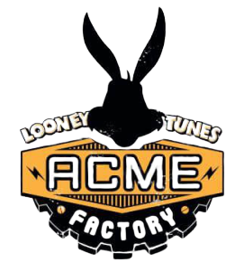
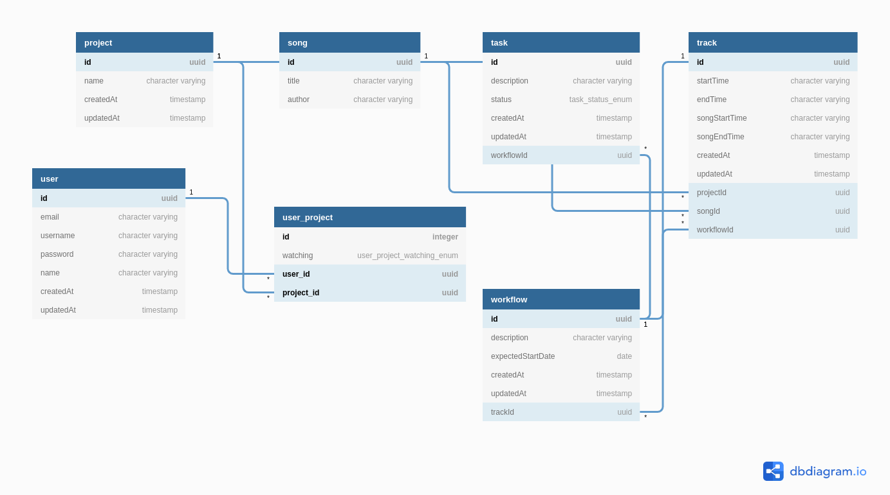

<span>

# ACME BROS Pictures

## QuickStart

```sh
$ git clone https://github.com/ulises-jeremias/acme-bros-pictures
$ cd acme-bros-pictures
```

### Server (with Database)

```sh
$ cd server
$ echo "DB_PASS=postgres\nDB_HOST=db" > .env
$ docker-compose -f docker-compose.yml up --build
```

> En the following [file](./server/README.md) you can find a complete guide about how to start the api and related scripts.

### Client

```sh
$ cd client
$ export API_BASE_URL=http://localhost:3000/api/v1/
$ yarn serve:prod
```

_or by using docker and nginx_,

```sh
$ ...
$ yarn docker:prod # or yarn docker:prod:build && yarn docker:prod:start
```

> En the following [file](./client/README.md) you can find a complete guide about how to start the client app and related scripts.

## Data Model

The data model used for the implementation of ACME BROS Pictures App can be seen in the following diagram,



It shows a summary of what the "complete" model could be, which would be defined taking into account different aspects of the domain and business, such as the presence of roles for the different users, permissions for resources access, dynamic definition of execution status of a given workflow task, etc.

## Api

The full API specification can be found in the following [file](./API.md).

> _Generated with [swagger-markdown](https://www.npmjs.com/package/swagger-markdown)_.

### Features:

Based on the suggested technologies and the proposed data model, the following stack of technologies is chosen.

 * [Node.js](https://nodejs.org/en/) - Javascript runtime
 * [Nodemon](https://nodemon.io/) - server auto-restarts when code changes
 * [Koa v2](https://koajs.com/) - next generation web framework for node.js.
 * [TypeORM](https://typeorm.io/) (SQL DB) with basic CRUD included
 * [Class-validator](https://github.com/typestack/class-validator) - Decorator based entities validation
 * [Node-input-validator](https://www.npmjs.com/package/node-input-validator) - Node Input Validator is a validation library for node.js.
 * [TSLint](https://palantir.github.io/tslint/) - An extensible linter for the TypeScript language
 * [Jest](https://jestjs.io/) - Test framework

### Included middlewares:

 * koa-router
 * koa-bodyparser
 * koa-response-time
 * koa-compress
 * koa-static
 * swagger-ui-koa
 * swagger-jsdoc
 * Helmet (security headers)
 * CORS
 * Winston Logger

## Client

> _Project layout generated by using [react-redux-webpack-starter](https://github.com/ulises-jeremias/react-redux-webpack-starter)._

### Features

 * [Node.js](https://nodejs.org/en/) - Javascript runtime
 * [React](https://reactjs.org/) - A javascript library for building user interfaces
 * [React Router](https://reacttraining.com/react-router/) - Declarative routing for React
 * [Redux](https://redux.js.org) - Redux is a predictable state container for JavaScript apps.
 * [Redux-Promise-Middleware](https://github.com/pburtchaell/redux-promise-middleware) - Redux middleware for promises, async functions and conditional optimistic updates
 * [Redux-Thunk](https://github.com/reduxjs/redux-thunk) - Thunk middleware for Redux
 * [Babel](https://babeljs.io/) - A transpiler for javascript
 * [Webpack](https://webpack.js.org/) - A module bundler
 * [LESS](http://lesscss.org/) - A css metalanguage

## Immediate Visibility

> Proposal

To give immediate visibility on the changes in the status of the workflow, the use of FCM is proposed.

Firebase Cloud Messaging (FCM) offers a broad range of messaging options and capabilities.

FMC offers two types of messages: notification messages and data messages. With them you can notify the change of the status of the workflow or even send the corresponding client the information that allows you to determine which tasks of the workflow to update to keep the data always updated.

For this, the current data model presents in the relationship between projects and users the attribute "watching" that allows determining the degree of interest of a user regarding the changes of state in the workflows for each project.
